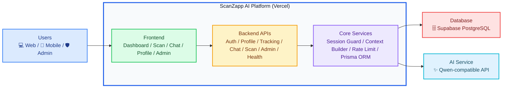

# ScanZapp AI Architecture

This version is designed for presentations: four major blocks, straight flow, and minimal crossing lines.

## Diagram explanation

### 1. Users

This block represents the people who use the system:

- Web users access the main web application.
- Mobile users use the same responsive interface on phones or tablets.
- Admin users access management features for system oversight.

### 2. ScanZapp AI Platform (Vercel)

This is the main application runtime and contains three internal layers:

- `Frontend`
  - Renders the user interface.
  - Includes the dashboard, food scan page, AI chat page, profile page, and admin panel.

- `Backend APIs`
  - Receives requests from the frontend.
  - Handles authentication, profile updates, meal and water tracking, chat requests, food scan requests, admin operations, and health checks.

- `Core Services`
  - Contains shared system logic.
  - `Session Guard` checks login state and role access.
  - `Context Builder` prepares user context for AI chat.
  - `Rate Limit` protects AI-related endpoints from excessive usage.
  - `Prisma ORM` is the data access layer used to communicate with the database.

### 3. Database

The main production database is `Supabase PostgreSQL`.

It stores the application's persistent data, such as:

- users and sessions
- profiles and settings
- meals and water logs
- chat conversations and messages
- scan results
- admin-related records and rate-limit buckets

### 4. AI Service

The external AI service is a `Qwen-compatible API`.

It is used mainly for:

- food image analysis
- AI chat responses

## Main request flow

The system flow is intentionally simple:

1. Users interact with the frontend.
2. The frontend sends requests to backend APIs.
3. Backend APIs use core services for auth, business rules, AI preparation, and database access.
4. Core services store or read data from Supabase PostgreSQL.
5. Core services call the Qwen-compatible AI API when AI functionality is needed.

## How to export or download

If you want this as an image:

1. Open [docs/architecture.mmd](/Users/ththzz/Documents/June/Project/ScanZapp Ai/SacnZappAI/docs/architecture.mmd)
2. Copy the Mermaid source
3. Paste it into [Mermaid Live Editor](https://mermaid.live)
4. Choose `Actions`
5. Download as `PNG` or `SVG`

If your Markdown viewer supports Mermaid, you can also open [docs/architecture.md](/Users/ththzz/Documents/June/Project/ScanZapp Ai/SacnZappAI/docs/architecture.md) directly and use it as the presentation source.
